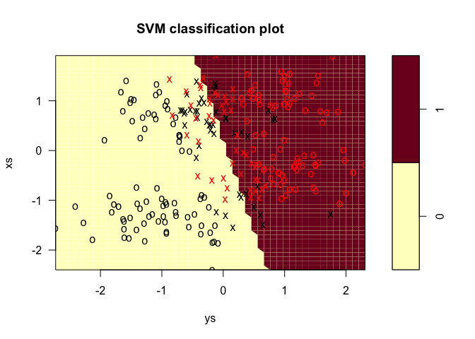
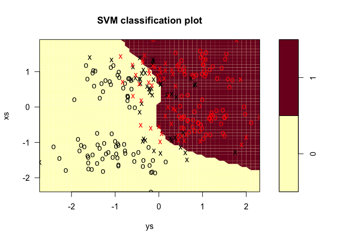

1. Suppose *X* ∈ ℝ*p* and *Y* ∈ −1, 1. For any real-valued function f on ℝ*p*, let L(Y,f(X)) denote the loss function for measuring errors between Y and f(X). Let *f*\* = *a**r**g**m**i**n**f**E**L*(*Y*, *f*(*X*)), where the expectation is taken over the joint distribution of X and Y. Show that:
----------------------------------------------------------------------------------------------------------------------------------------------------------------------------------------------------------------------------------------------------------------------------------------------------------------------------------------------------

### (a) (Logistic Regression) If *L*(*y*, *f*(*x*)) = *l**o**g*\[1 + *e**x**p*(−*y**f*(*x*))\], then $f^\*(x) = log \\frac{Pr(Y=1| X=x)} {Pr(Y=-1 | X=x)}$.

In general, the goal of this learning problem is to minimize the
expected risk:
*E**L*(*Y*, *f*(*X*)) = ∫*X* × *Y**L*(*y*, *f*(*x*))*P**r*(*x*, *y*)*d**x**d**y*,
where *P**r*(*x*, *y*)=*P**r*(*y*|*x*)*P**r*(*x*) and
*L*(*y*, *f*(*x*)) = *ϕ*(*y**f*(*x*)), so we can rewrite the expected
risk as:

$$
\\begin{split}
EL(Y, f(X)) &= \\int\_{X\\times Y} L(y, f(x))Pr(x, y)dxdy \\\\
&= \\int\_{X} \\int\_{Y} \\phi(yf(x))Pr(y|x)Pr(x)dxdy \\\\
&= \\int\_{X} \[\\phi(f(x))Pr(1|x) + \\phi(-f(x))Pr(-1|x)\] Pr(x)dx \\\\
&= \\int\_{X} \[\\phi(f(x))Pr(1|x) + \\phi(-f(x))(1-Pr(1|x))\] Pr(x)dx \\\\
\\end{split}
$$

Here we set *η* = *P**r*(1|*x*), and by taking the functional derivative
of the term
\[*ϕ*(*f*(*x*))*P**r*(1|*x*)+*ϕ*(−*f*(*x*))(1 − *P**r*(1|*x*))\] with
respect to *f* and setting the derivative equal to 0 we get:

$$
\\frac{\\partial \\phi(f)}{\\partial f}\\eta + \\frac{\\partial \\phi(-f)}{\\partial f}(1-\\eta) = 0
\\tag{1}
$$

For question (a), the
*ϕ*(*y**f*(*x*)) = *l**o**g*\[1 + *e**x**p*(−*y**f*(*x*))\], hence
*ϕ*(*f*)=*l**o**g*\[1 + *e**x**p*(−*f*)\], solving equation (1) we get:

$$
\\begin{split}
\\frac{-e^{-f^\*}}{1+e^{-f^\*}}\\eta + \\frac{e^{f^\*}}{1+e^{f^\*}}(1-\\eta) = 0 \\\\
\\frac{e^{f^\*}}{1+e^{f^\*}} = \\eta \\\\
f^\* = log\\frac{\\eta}{1-\\eta}
\\end{split}
$$

So the minimizer is
$f^\*(x) = log \\frac{Pr(Y=1| X=x)} {1 - Pr(Y=1 | X=x)} = log \\frac{Pr(Y=1| X=x)} { Pr(Y=-1 | X=x)}$.

### (b) (SVM) If *L*(*y*, *f*(*x*)) = \[1 − *y**f*(*x*)\]+, then $f^\*(x) = sign\[Pr(Y=1 | X=x) - \\frac{1}{2}\]$.

Take the derivative of *ϕ*(*f*)=\[1 − *f*\]+ and
*ϕ*(−*f*)=\[1 + *f*\]+ we get:

$$
\\phi'(f) = 
\\begin{cases}
  -1, & f&lt;1 \\\\
  0, & f \\geq 1
\\end{cases}
$$

$$
\\phi'(-f) = 
\\begin{cases}
  1, & f&gt;-1 \\\\
  0, & f \\leq -1
\\end{cases}
$$

We try to solve equation (1) under several cases:

-   when −1 &lt; *f*\* &lt; 1, we have −*η* + 1 − *η* = 0, so
    $\\eta = \\frac{1}{2}$, but the solution is undefined

-   when *f*\* = −1, we have −*η* + 0 = 0, so *η* = 0

-   when *f*\* = 1, we have 0 + 1 − *η* = 0, so *η* = 1

Combining all the cases above, we get
$f^\*(x) = sign\[Pr(Y=1 | X=x) - \\frac{1}{2}\]$

### (c) (Regression) If *L*(*y*, *f*(*x*)) = \[*y* − *f*(*x*)\]2, then *f*\*(*x*)=2*P**r*(*Y* = 1|*X* = *x*)−1.

From text book, the squared error
\[*y* − *f*(*x*)\]2 = \[1 − *y**f*(*x*)\]2, so
*ϕ*(*f*)=\[1 − *f*\]2. Solving equation (1) we get:

$$
\\begin{split}
-2(1 - f^\*)\\eta + 2(1+f^\*)(1-\\eta) = 0 \\\\
f^\* = 2\\eta - 1
\\end{split}
$$

So the minimizer is *f*\*(*x*)=2*P**r*(*Y* = 1|*X* = *x*)−1.

### (d) (AdaBoost) If *L*(*y*, *f*(*x*)) = *e**x**p*\[−*y**f*(*x*)\], then $f^\*(x) = \\frac{1}{2} log \\frac{Pr(Y=1| X=x)} {Pr(Y=-1 | X=x)}$.

*ϕ*(*f*)=*e*−*f*. Solving equation (1) we get:

$$
\\begin{split}
-e^{-f^\*}\\eta + e^{f^\*} (1-\\eta) = 0 \\\\
e^{2f^\*}(1-\\eta) = \\eta \\\\
f^\* = \\frac{1}{2}log\\frac{\\eta}{1-\\eta}
\\end{split}
$$

So the minimizer is
$f^\*(x) = \\frac{1}{2}log\\frac{Pr(Y=1| X=x)}{1-Pr(Y=1| X=x)} = \\frac{1}{2}log\\frac{Pr(Y=1| X=x)}{Pr(Y=-1| X=x)}$.

2. Get the “Ripleydataset” (synth.tr) from the website <http://www.stats.ox.ac.uk/pub/PRNN/>. The dataset contains two predictors and a binary outcome.
-------------------------------------------------------------------------------------------------------------------------------------------------------

### (a) Construct a linear support vector classifier.

### (b) Construct a support vector classifier with Radial kernel.

### (c) Construct a classifier using AdaBoost algorithm (with 50 boosting iterations) with decision stumps as weak learners.

Select the tuning parameter involved in SVM models appropriately. For each method, compute the test error and its standard error on the test set (synth.te). Provide a simple graphical visualization of the produced classification models (i.e. something similar to Figure 2.2 in the textbook \[ESL\]) and discuss your results.
------------------------------------------------------------------------------------------------------------------------------------------------------------------------------------------------------------------------------------------------------------------------------------------------------------------------------------

Since this is a classification problem, we use misclassification rate as
the test error.

<table>
<thead>
<tr class="header">
<th></th>
<th align="right">svm.linear</th>
<th align="right">svm.raidal</th>
<th align="right">adaboost</th>
</tr>
</thead>
<tbody>
<tr class="odd">
<td>misclassification rate</td>
<td align="right">0.1010000</td>
<td align="right">0.09300</td>
<td align="right">0.1280000</td>
</tr>
<tr class="even">
<td>standard error</td>
<td align="right">0.3179624</td>
<td align="right">0.30511</td>
<td align="right">0.3547137</td>
</tr>
</tbody>
</table>

The result shows that for the `synth` data, support vector classifier
with Radial kernel has the best performance, while adaboost has the
worst.

Appendix
--------

    knitr::opts_chunk$set(echo = FALSE, message = FALSE, warning = FALSE, comment = "")
    library(tidyverse)
    library(e1071)  # for SVM
    library(JOUSBoost)  # for adaboost
    library(ada)
    # load train and test data
    train <- read.table("synth.tr", header = T) %>% 
      as.tibble() %>% 
      mutate(yc = as.factor(yc), 
             xs = scale(xs), 
             ys = scale(ys))

    test <- read.table("synth.te", header = T) %>% 
      as.tibble() %>% 
      mutate(yc = as.factor(yc), 
             xs = scale(xs), 
             ys = scale(ys))

    # linear SVM
    svm.linear = svm(yc ~ ., data = train, type = 'C-classification', kernel = 'linear')
    pred.svm.linear = predict(svm.linear, test)

    err.svm.linear = sum((as.numeric(pred.svm.linear) - as.numeric(test$yc)) != 0) / length(test$yc)
    stderr.svm.linear = sqrt(var(as.numeric(pred.svm.linear) - as.numeric(test$yc)))
    plot(svm.linear, train)

    # radial SVM
    svm.radial = svm(yc ~ ., data = train, type = 'C-classification', kernel = 'radial')
    pred.svm.radial = predict(svm.radial, test)

    err.svm.radial = sum((as.numeric(pred.svm.radial) - as.numeric(test$yc)) != 0) / length(test$yc)
    stderr.svm.radial = sqrt(var(as.numeric(pred.svm.radial) - as.numeric(test$yc)))
    plot(svm.radial, train)

    # adaboost
    train.ada = train %>% 
      mutate(yc = ifelse(yc == 1, 1, -1)) %>% 
      as.matrix()
    test.ada = test %>% 
      mutate(yc = ifelse(yc == 1, 1, -1)) %>% 
      as.matrix()

    ada = adaboost(train.ada[,c(1,2)], train.ada[,3], tree_depth = 1, n_rounds = 50)
    pred.ada = predict(ada, test.ada[,c(1,2)])

    err.ada = sum((as.numeric(pred.ada) - as.numeric(test.ada[,3])) != 0) / length(test.ada[,3])
    stderr.ada = sqrt(var((as.numeric(pred.ada) - as.numeric(test.ada[,3]))/2))

    # output test error and standard error
    err.output <- tibble(
      svm.linear = c(err.svm.linear, stderr.svm.linear),
      svm.raidal = c(err.svm.radial, stderr.svm.radial),
      adaboost = c(err.ada, stderr.ada)
    )
    rownames(err.output) = c("misclassification rate", "standard error")
    err.output %>% knitr::kable()
